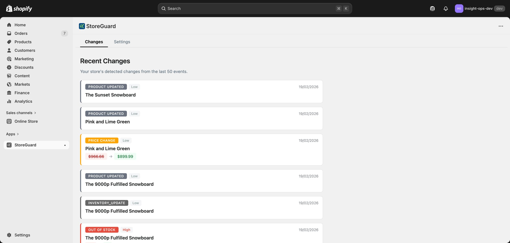
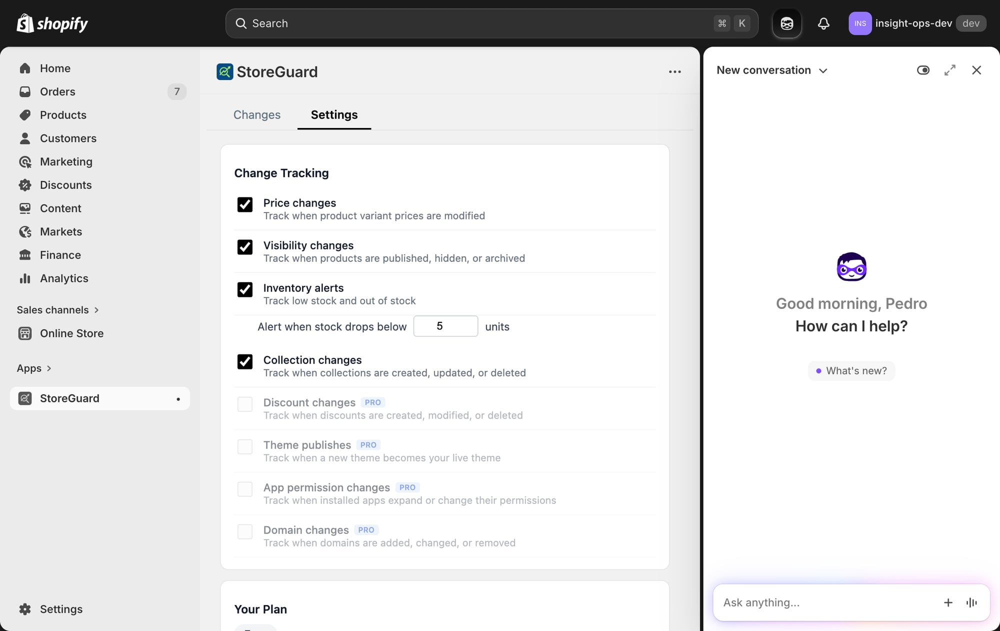
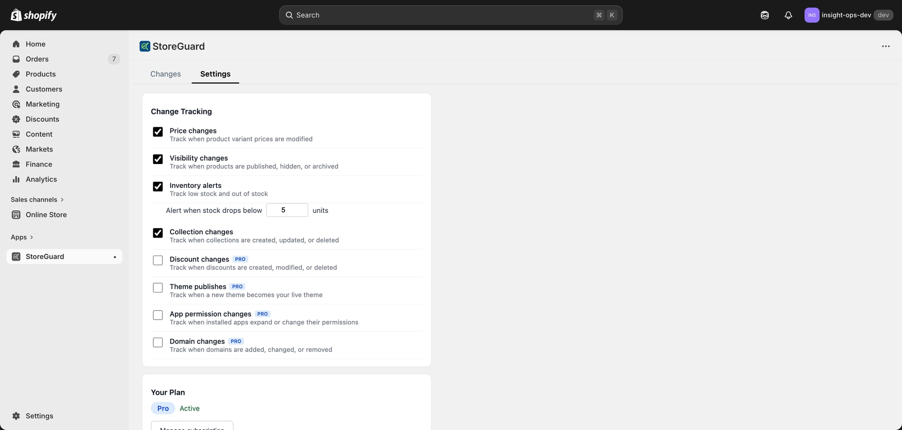
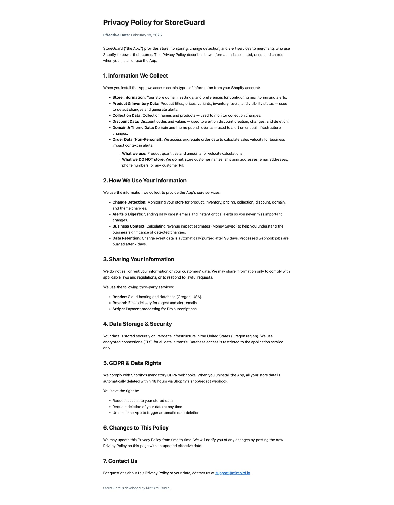

# 🛡️ StoreGuard — App Overview

**Tagline:** Your Shopify store's security camera. Know every change before it costs you money.

**Category:** Store Monitoring & Change Detection
**Platform:** Shopify App Store (Embedded App)
**Developer:** MintBird Studio
**URL:** https://storeguard-app.onrender.com
**Support:** support@mintbird.io

---

## What Is StoreGuard?

StoreGuard is a Shopify app that monitors your store for critical changes — price modifications, inventory going to zero, products being hidden, collections deleted, discounts changed, and more — and alerts you before those changes cost you revenue.

Think of it as a **flight recorder for your Shopify store**. Every change is logged, categorized by severity, and presented in a clean timeline so you always know what happened, when, and how it impacts your business.

---

## The Problem

Shopify stores experience constant changes — staff edits, app integrations, bulk operations, theme updates. Most merchants have **no visibility** into what changed and when. A mispriced product can run for hours. A hidden bestseller can go unnoticed for days. An expired discount code can frustrate customers silently.

**StoreGuard catches what you'd miss.**

---

## Core Features

### 1. 📋 Changes Tab — Real-Time Event Timeline

The main view shows all detected changes in chronological order with color-coded badges:

| Badge | Color | What It Detects |
|-------|-------|-----------------|
| **Price Change** | 🟠 Orange | Variant price modifications (shows old → new) |
| **Out of Stock** | 🔴 Red | Inventory dropping to zero (HIGH importance) |
| **Low Stock** | 🟠 Orange | Inventory below configured threshold |
| **Visibility Change** | 🟣 Purple | Products going Active ↔ Draft ↔ Archived |
| **Product Updated** | ⚫ Gray | General product modifications |
| **Product Created** | 🟢 Green | New products added to store |
| **Collection Created/Updated/Deleted** | 🟢/🔴 | Collection lifecycle changes |
| **Discount Created/Changed/Deleted** | 🟣 Purple | Discount code changes (Pro) |
| **Theme Published** | 🔵 Blue | Live theme switches (Pro) |
| **App Permissions** | 🔵 Indigo | Installed app scope expansions (Pro) |
| **Domain Changed/Removed** | 🔵/🔴 Cyan | Domain configuration changes (Pro) |

Each event shows:
- **Event type badge** with color coding
- **Importance level** (High/Medium/Low)
- **Resource name** (product/collection/discount name)
- **Date** of detection
- **Before → After values** where applicable (e.g., $966.66 → $899.99)


*Changes tab showing price change ($966.66 → $899.99), out of stock alert (HIGH), and product updates*

---

### 2. ⚙️ Settings Tab — Full Control

Three sections give merchants complete control:

#### Change Tracking
Toggle monitoring for each change type individually:
- ✅ **Free:** Price changes, visibility changes, inventory alerts, collection changes
- 🔒 **Pro:** Discount changes, theme publishes, app permission changes, domain changes

Inventory alerts include a configurable **low stock threshold** (default: 5 units).

#### Your Plan
- Shows current plan (Free/Pro) with status badge
- **Upgrade to Pro — $19/mo** button (Stripe Checkout)
- **Manage subscription** button for Pro users (Stripe Customer Portal)

#### Notifications
- **Instant alerts** (Pro) — email immediately on critical changes
- **Daily digest** — summary email for all recipients
- Email chip interface — add/remove multiple recipient addresses


*Settings page on Free plan — Pro features visible but locked*


*Settings page on Pro plan — all features unlocked, "Manage subscription" available*

---

### 3. 💰 Money Saved Dashboard

Estimates the revenue impact of detected changes using a conservative 50% factor. Shows merchants how much money StoreGuard has helped them save by catching problems early. Drives retention by making the app's value tangible.

---

### 4. 📧 Email Alerts

Two types of email notifications:

- **Daily Digest** — Scheduled summary of all changes from the past 24 hours, sent at ~8am UTC
- **Instant Alerts** (Pro) — Immediate email for critical changes:
  - Price drops >50%
  - Out of stock events
  - Products hidden from store
  - Domain removals
  - App permission expansions

Mobile-responsive HTML templates tested across Gmail, Outlook, and Apple Mail.

---

### 5. 🔒 Privacy & GDPR

Full compliance with Shopify's privacy requirements:

- **No customer PII stored** — no names, emails, addresses, phone numbers
- **Automatic data deletion** on app uninstall (shop/redact webhook)
- **90-day data retention** with automatic purge
- Third-party services: Render (hosting), Resend (email), Stripe (billing)


*Complete privacy policy page at /privacy*

---

## Pricing

| | Free | Pro |
|---|---|---|
| **Price** | $0 | $19/mo |
| **Products** | Up to 50 | Unlimited |
| **Price changes** | ✅ | ✅ |
| **Visibility changes** | ✅ | ✅ |
| **Inventory alerts** | ✅ | ✅ |
| **Collection changes** | ✅ | ✅ |
| **Daily digest email** | ✅ | ✅ |
| **Discount monitoring** | — | ✅ |
| **Theme monitoring** | — | ✅ |
| **App permissions** | — | ✅ |
| **Domain monitoring** | — | ✅ |
| **Instant email alerts** | — | ✅ |
| **Money Saved dashboard** | — | ✅ |
| **Context enrichment** | — | ✅ |

Billing via Stripe Checkout with customer portal for self-service management.

---

## Technical Architecture

### Stack
- **Framework:** React Router (Remix) + Shopify App Bridge
- **Language:** TypeScript
- **Database:** PostgreSQL (Prisma ORM)
- **Hosting:** Render (web service + managed DB)
- **Email:** Resend
- **Billing:** Stripe
- **Webhooks:** 10+ Shopify webhook subscriptions

### Webhook Processing
All webhooks ACK within 500ms via a background job queue:
1. Webhook arrives → immediate 200 response
2. Job queued in PostgreSQL
3. Background processor claims job (atomic, race-condition safe)
4. Change detection runs against stored snapshots
5. ChangeEvent created with importance classification
6. Instant alert sent if criteria met (Pro)

### Shopify Scopes
```
read_products, read_inventory, read_themes, read_discounts, read_orders
```

### Key Services
| Service | Purpose |
|---------|---------|
| `jobProcessor.server.ts` | Webhook job queue processing |
| `changeDetection.server.ts` | Price, visibility, inventory change detection |
| `contextEnricher.server.ts` | Business context for alerts |
| `moneySaved.utils.ts` | Revenue impact estimation |
| `dailyDigest.server.ts` | Daily email digest compilation |
| `emailTemplates.server.ts` | Responsive HTML email templates |
| `stripeService.server.ts` | Billing & subscription management |
| `scheduler.server.ts` | In-process cron for daily digest |
| `salesVelocity.server.ts` | Sales velocity calculations |
| `productSync.server.ts` | Initial product sync with pagination |

### Data Model (Key Tables)
| Table | Purpose |
|-------|---------|
| `Shop` | Store settings, plan, Stripe IDs |
| `ChangeEvent` | All detected changes (main timeline) |
| `ProductSnapshot` | Latest product state for diff detection |
| `VariantSnapshot` | Per-variant atomic snapshots |
| `WebhookJob` | Background job queue |
| `ProductCache` | Product title cache for display |

---

## Test Results Summary

| Test | Result |
|------|--------|
| App loads in Shopify admin | ✅ Pass |
| Changes tab shows events | ✅ Pass |
| Price change detection | ✅ Pass ($966.66 → $899.99) |
| Inventory out of stock | ✅ Pass (20 → 0, HIGH) |
| Visibility change detection | ✅ Pass (Active → Draft) |
| Discount monitoring (Pro gate) | ✅ Pass (correctly hidden on Free) |
| Settings page renders | ✅ Pass |
| Pro upgrade via Stripe | ✅ Pass (test mode) |
| Pro features unlock | ✅ Pass |
| Privacy page | ✅ Pass |
| 298 automated tests | ✅ All passing |

### Bugs Found & Fixed During Testing
1. ~~Visibility changes showed as generic PRODUCT_UPDATED~~ → Fixed: now shows dedicated "Visibility Change" badge
2. ~~Stripe customer mismatch between live/test keys~~ → Fixed: added customer verification fallback
3. ~~Billing redirect used wrong app handle~~ → Fixed: `/apps/insightops`
4. ~~No Stripe test webhook endpoint~~ → Fixed: created and configured

---

## Infrastructure

| Component | Details |
|-----------|---------|
| **App URL** | https://storeguard-app.onrender.com |
| **Render Service** | srv-d5vmdq1r0fns73ee53v0 (Starter, Oregon) |
| **Database** | PostgreSQL basic_256mb ($1/mo) |
| **Monthly Cost** | $8 (web $7 + DB $1) |
| **Repository** | github.com/botainic/storeguard |
| **Shopify Partners** | MintBird Studio (org 4646756) |
| **App Store** | Published, 2 active installs |
| **Dev Store** | insight-ops-dev.myshopify.com |

---

## What's Next

1. **Shopify App Store listing polish** — description, feature bullets, screenshots
2. **Target "Built for Shopify" badge** — requires meeting Shopify's quality standards
3. **Stripe webhook signature verification** — currently a TODO, needed for production security
4. **Swap back to live Stripe keys** — test keys currently deployed
5. **Marketing & growth** — app store SEO, content marketing
