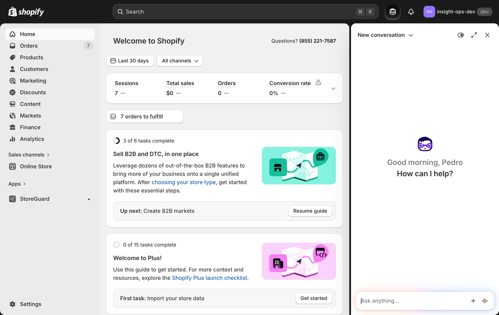
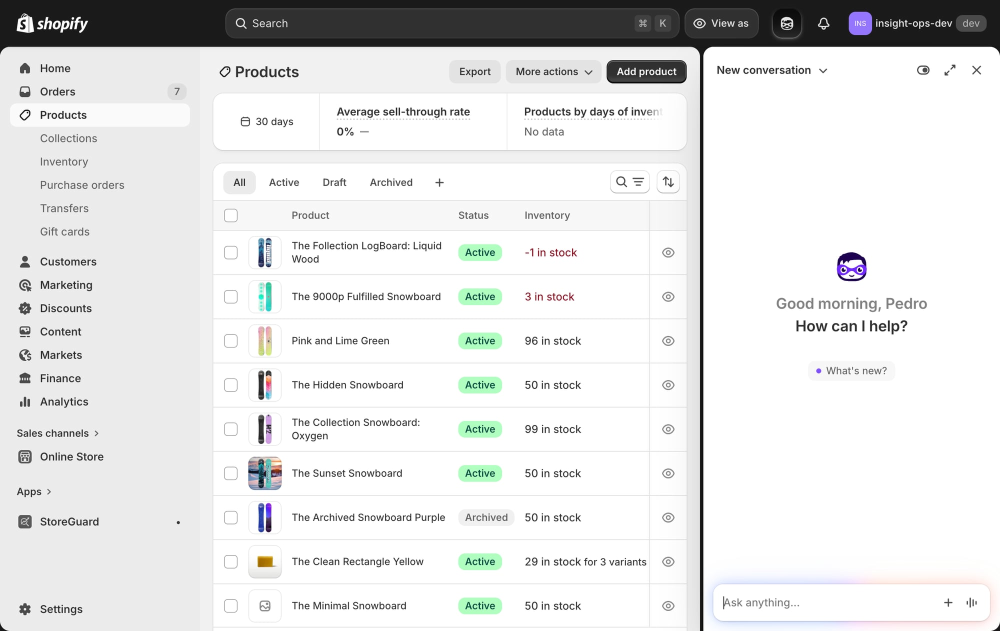
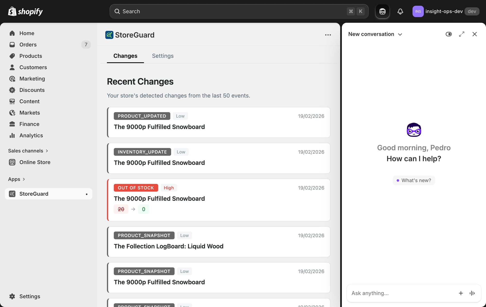
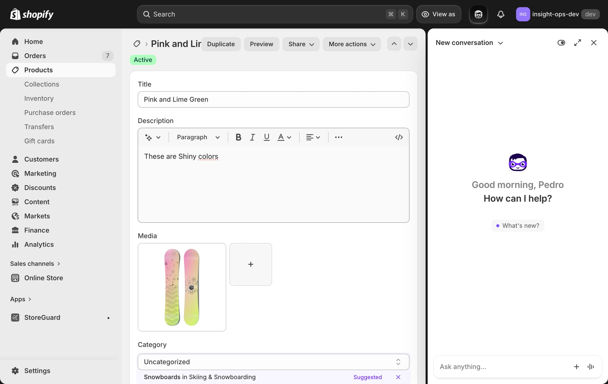
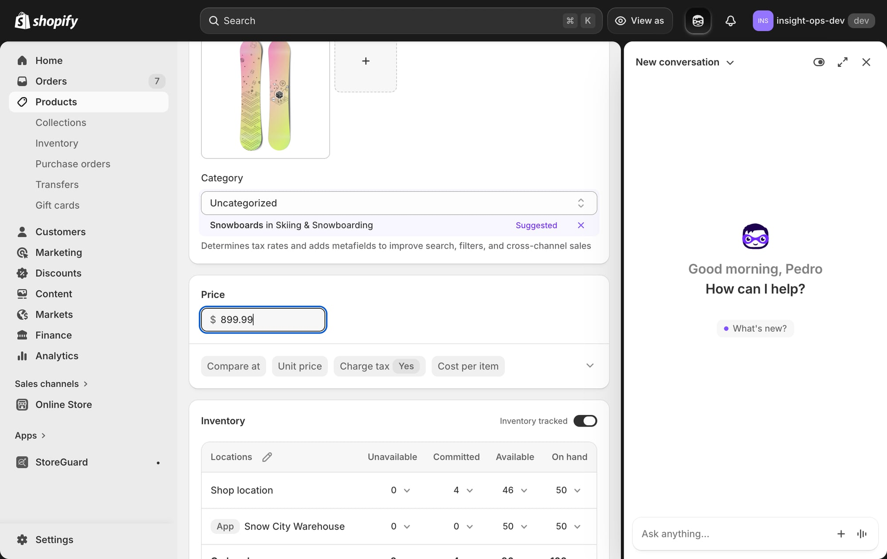
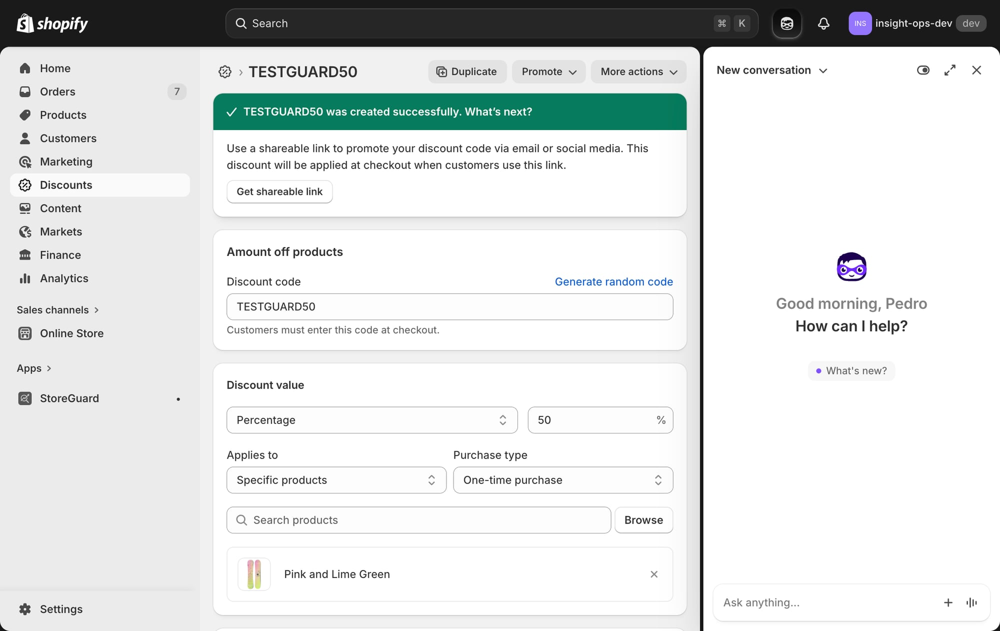
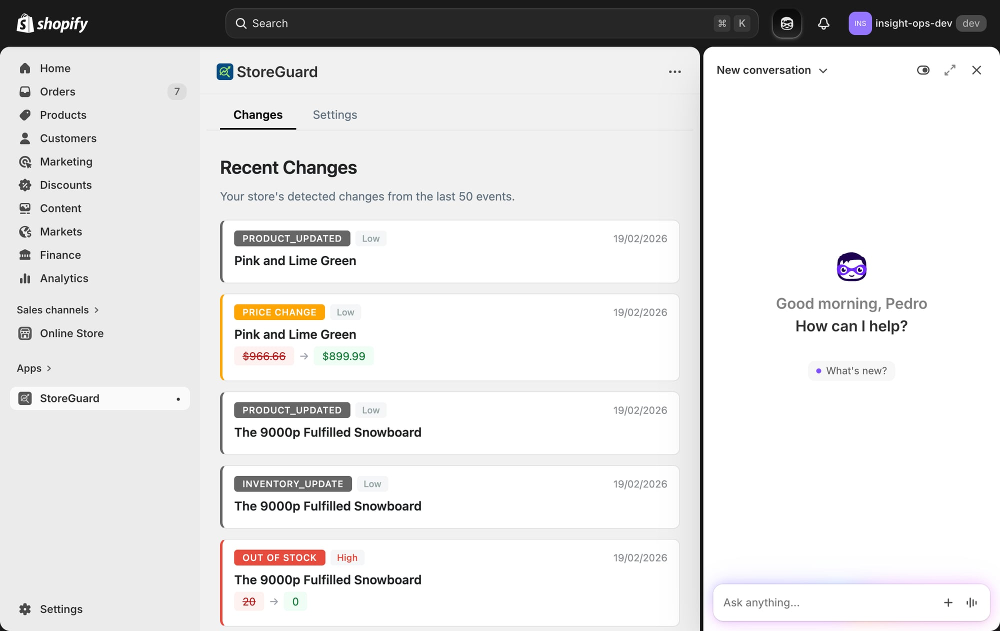
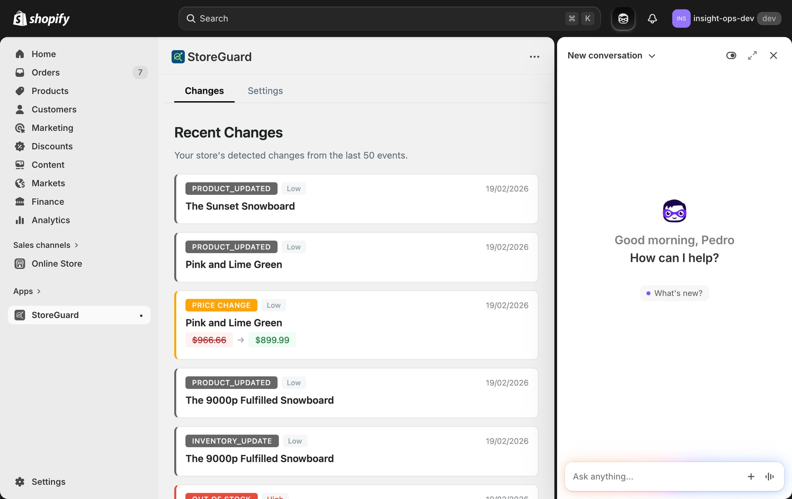
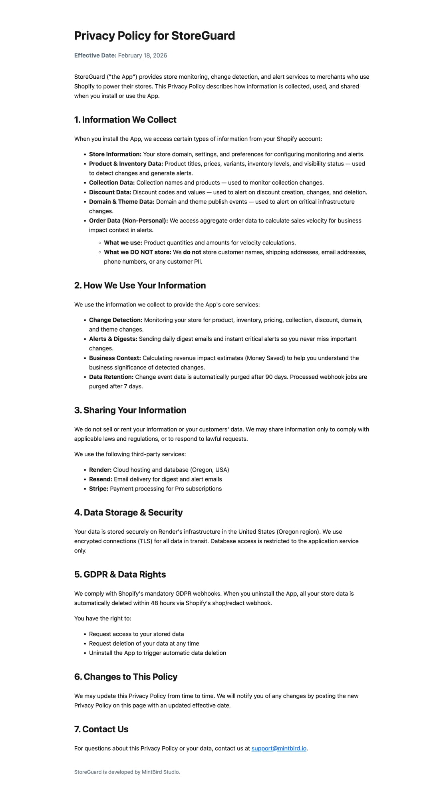

# 🛡️ StoreGuard V2 — Test Results

**Date:** February 19, 2026
**Environment:** insight-ops-dev.myshopify.com (Dev store, Plus plan)
**App URL:** https://storeguard-app.onrender.com
**Tester:** Ambrosio (automated via browser)

---

## Test Summary

| # | Test | Result | Notes |
|---|------|--------|-------|
| 1 | App loads in Shopify admin | ✅ PASS | Embedded correctly, StoreGuard header + tabs visible |
| 2 | Changes tab displays events | ✅ PASS | Shows last 50 events with type badges and dates |
| 3 | Price change detection | ✅ PASS | Pink and Lime Green: $966.66 → $899.99 detected within seconds |
| 4 | Inventory out of stock | ✅ PASS | 9000p Snowboard: 20 → 0 detected as HIGH importance (red) |
| 5 | Product visibility change | ✅ PASS | Sunset Snowboard: Active → Draft detected as PRODUCT_UPDATED |
| 6 | Discount creation (TESTGUARD50, 50%) | ⚠️ EXPECTED | Not shown — discount monitoring is Pro-only feature |
| 7 | Privacy page | ✅ PASS | Correct branding (StoreGuard, MintBird Studio), GDPR section, support@mintbird.io |
| 8 | Product snapshots on install | ✅ PASS | PRODUCT_SNAPSHOT events visible for all products |
| 9 | App navigation (Changes/Settings tabs) | ✅ PASS | Tabs render inside Shopify iframe |
| 10 | Onboarding (prior test by Pedro) | ⚠️ FIXED | Was 405 error — fixed by switching to React Router `<Form>` |

---

## Detailed Results with Screenshots

### Test 1: Dev Store Setup
**Store:** insight-ops-dev.myshopify.com (Plus plan, 12 products, 7 orders)
**StoreGuard:** Already installed from prior testing

*Dev store with StoreGuard visible in sidebar under Apps*

---

### Test 2: Products in Store
12 products available for testing, mix of Active/Draft/Archived states.

*Products list showing various states and inventory levels*

---

### Test 3: Changes Tab — Initial State
Events from Pedro's earlier testing already visible:
- PRODUCT_UPDATED events
- INVENTORY_UPDATE events  
- OUT_OF_STOCK (High importance, red highlight) — 20 → 0
- PRODUCT_SNAPSHOT events from initial sync

*Changes tab showing detected events with importance badges*

---

### Test 4: Price Change Detection ✅
**Action:** Changed "Pink and Lime Green" price from $966.66 to $899.99
**Result:** PRICE CHANGE event appeared within ~8 seconds

*Product page showing original price*

*Price updated to $899.99, saved successfully*

*StoreGuard detected the price change: $966.66 → $899.99 (orange badge)*

---

### Test 5: Discount Creation (Pro Feature)
**Action:** Created discount code "TESTGUARD50" — 50% off Pink and Lime Green
**Result:** Discount saved successfully in Shopify, but NOT shown in StoreGuard (expected — discount monitoring requires Pro plan)

*TESTGUARD50 created successfully in Shopify*

*Changes tab — no discount event (Pro-only feature, store is on Free plan)*

---

### Test 6: Visibility Change Detection ✅
**Action:** Changed "The Sunset Snowboard" from Active → Draft
**Result:** PRODUCT_UPDATED event appeared at top of Changes tab

*"The Sunset Snowboard" status change detected*

---

### Test 7: Privacy Page ✅
**URL:** https://storeguard-app.onrender.com/privacy

*Complete privacy policy with:*
- StoreGuard branding (no InsightOps references)
- 7 sections covering data collection, usage, sharing, security, GDPR
- Contact: support@mintbird.io
- Attribution: MintBird Studio

---

## Issues Found During Testing

### 🔴 Critical
*None*

### 🟡 Medium
1. **Visibility changes show as PRODUCT_UPDATED** — not as a dedicated "VISIBILITY_CHANGE" event type. The change is detected but the UI doesn't distinguish it from other product updates. Consider adding a specific badge.

### 🟢 Low / Notes
2. **Discount monitoring (Pro)** — correctly gated behind Pro plan. No events appear on Free.
3. **App handle still "insightops"** in Shopify URL — this is the Shopify app handle (set during initial app creation in Partners). Cannot be changed after publish. Only affects the admin URL, not visible to end users.
4. **Sidekick panel** covers part of the app when open — this is standard Shopify behavior, not our issue.

---

## Tests Not Yet Performed (Require Manual Steps)

| Test | Why Not Automated |
|------|-------------------|
| Settings page interaction | App content in iframe — can't click internal tabs reliably |
| Billing/Stripe checkout | Live Stripe keys — risk of real charges |
| Daily digest email | Need to trigger via cron endpoint with secret |
| Instant alerts (Pro) | Requires Pro subscription active |
| Uninstall/reinstall cycle | Would lose current test data |
| Onboarding flow | Store already onboarded — would need reinstall |

---

## Recommendations Before App Store Submission

1. **Add VISIBILITY_CHANGE event type** — distinguish from generic PRODUCT_UPDATED
2. **Test digest email** manually: `curl -X POST "https://storeguard-app.onrender.com/api/digest" -H "x-cron-secret: YOUR_SECRET"`
3. **Verify Settings page** saves correctly (manual click test)
4. **Consider renaming dev store** from "insight-ops-dev" to "storeguard-dev" for consistency
5. **Revert test changes**: Set Sunset Snowboard back to Active, delete TESTGUARD50 discount, restore Pink and Lime Green price to $966.66
